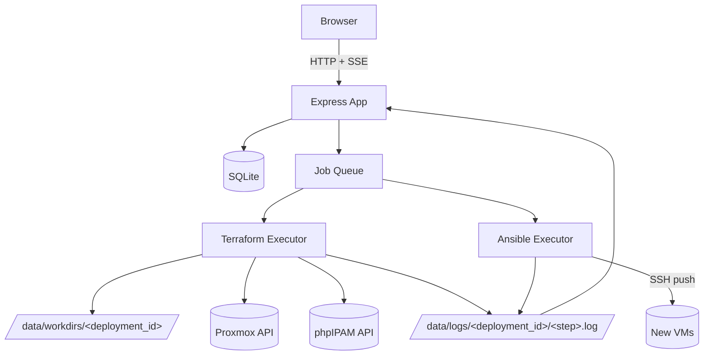

# Architecture

## Stack

| Layer | Choice | Why |
|---|---|---|
| Runtime | Node.js (LTS) | matches the requested stack |
| Web framework | Express | simple, well understood, no build step needed |
| Views | EJS (server-rendered) | lightweight, no SPA build pipeline; live logs use plain SSE client JS, not a client framework |
| Styling | Tailwind CSS + daisyUI, compiled at Docker build time | modern component styling (navbar, dropdown, badges, forms) without an SPA; small, one-time CSS build step (`npm run build:css`), not a bundler/router |
| DB | SQLite (`better-sqlite3`) | single-file, zero-ops, fine for a single-host home-lab tool |
| Auth | `express-session` (SQLite-backed store) + `bcrypt` password hashing | simple cookie session, single admin account |
| Live updates | Server-Sent Events (SSE) | one-way server→browser stream, trivial over plain HTTP, no extra infra |
| Process orchestration | Node `child_process.spawn` + a small in-process job queue | Forge already runs on the ansible/terraform host, so it can shell out directly |
| IaC | Terraform (`bpg/proxmox` provider), vendored copy of `proxmox-vm` module | reuse proven module, but decoupled from the `terraform-deployment` repo at runtime |
| Config mgmt | Ansible (`ansible-playbook`, push model) | see below |
| IP management | phpIPAM REST API | same instance/subnet already in use (`10.4.5.66`, subnet 7) |
| Packaging | Docker + docker-compose | portable, easy to redeploy on a different host later |

## High-level components

## Terraform execution

Forge does **not** reuse `terraform-deployment/environments/*` at runtime.
Instead:

- Forge vendors its own copy of `modules/proxmox-vm` under
  `forge/terraform/modules/proxmox-vm` (kept in sync manually/via a sync
  script when the upstream module changes — see
  [decisions](./06-decisions.md)).
- For each deployment, Forge generates an isolated working directory:
  `data/workdirs/<deployment_id>/` containing generated `main.tf`,
  `variables.tf`, `provider.tf` (module source points at the vendored copy
  by relative/absolute local path).
- Terraform state lives in that same working directory
  (`terraform.tfstate`), so each deployment is fully isolated — no shared
  state file, no risk of one deployment's `apply`/`destroy` touching
  another's resources.
- Forge shells out to `terraform init`, `terraform apply -auto-approve`,
  and `terraform destroy -auto-approve` via `child_process.spawn`,
  streaming stdout/stderr line-by-line into the step's log file + SSE
  channel.
- `ipam-config.tf`-equivalent values (URL, app id, credentials) are
  injected as generated `TF_VAR_*` env vars / generated `.auto.tfvars`,
  sourced from Forge's own config (env vars), not symlinked.

## Ansible execution

Switching from the current **pull** model (Terraform's `remote-exec`
provisioner SSHes into the new VM and runs `ansible-pull`) to a **push**
model driven by Forge:

- After `terraform apply` succeeds and each node passes
  `cloud-init status --wait` (checked over SSH by Forge), Forge generates a
  dynamic inventory file for the deployment
  (`data/workdirs/<deployment_id>/inventory.ini`) from the
  `deployment_nodes` table.
- Forge runs `ansible-playbook -i inventory.ini <role-playbook>.yml` as a
  child process (using the existing `~/.ssh/id_rsa` / `zhaho` user already
  trusted via the template), streaming output the same way as Terraform.
- This gives Forge full control over **when** config happens, lets a
  single step be re-run on demand, and keeps all logs centralized instead
  of scattered across VM-local ansible-pull logs.

## Job queue / concurrency

- Deployments run **in parallel** (each has its own Terraform workdir/state
  and its own Ansible inventory, so there's no shared-state conflict).
- Steps **within** a single deployment run strictly sequentially (a
  per-deployment mutex), since each step depends on the previous one's
  output (e.g. you need IPs before generating `.tf` files, need VMs up
  before running Ansible).
- The queue is in-process (no Redis/external broker) — acceptable since
  Forge is a single-instance home-lab tool. Job/step state is persisted to
  SQLite so that if Forge restarts mid-job, the step is marked
  `interrupted` on boot and can be manually retried from the GUI.

## Auth

- On boot, if the `users` table is empty → root path redirects to
  `/register` (one-time setup, creates the single admin user, password
  hashed with bcrypt).
- Once a user exists, `/register` is disabled (redirects to `/login`).
- Session-based auth (`express-session`, SQLite store), all routes except
  `/login` and first-run `/register` require an authenticated session.

## Logging

- Every step writes to its own log file under
  `data/logs/<deployment_id>/<step_seq>-<step_name>.log`.
- The DB stores only the file path + status/timestamps, not the log
  content itself (keeps SQLite small, avoids giant TEXT columns).
- The GUI tails the active step's log file over SSE; completed steps'
  logs are served as static/downloadable text.

## Docker packaging

Forge itself runs in Docker from v1 (not just a later add-on), so it can
be redeployed on a different host easily:

- **Image**: Node.js base image + Terraform CLI + Ansible + `ssh` client
  installed. Non-root user inside the container.
- **Networking**: bridge network with a single mapped port for the GUI
  (e.g. `3000:3000`). No host networking and no Docker socket access are
  needed — Forge only needs outbound reachability to the Proxmox API,
  phpIPAM, and the LAN subnet the new VMs live on, all of which are
  reachable from a normal bridge network on this Docker host.
- **Persistent volume**: a single bind-mounted `data/` directory holding
  everything that must survive a container recreate:
  - `data/forge.sqlite` (the DB)
  - `data/workdirs/<deployment_id>/` (Terraform configs + state per
    deployment)
  - `data/logs/<deployment_id>/` (step logs)
  - `data/tf-plugin-cache/` (set as `TF_PLUGIN_CACHE_DIR` so repeated
    `terraform init` calls across workdirs don't re-download the same
    provider plugin every time)
- **Secrets/config**: SSH private key mounted read-only (e.g.
  `~/.ssh/id_rsa` → `/home/forge/.ssh/id_rsa`, mode `600`); Proxmox/IPAM
  credentials and session secret via environment variables (`.env` file
  used by docker-compose, not committed to git).
- **docker-compose.yml** at the repo root defines the single `forge`
  service, its port mapping, the `data/` and SSH-key mounts, and env file
  reference — `docker compose up -d` is the whole deployment story.
