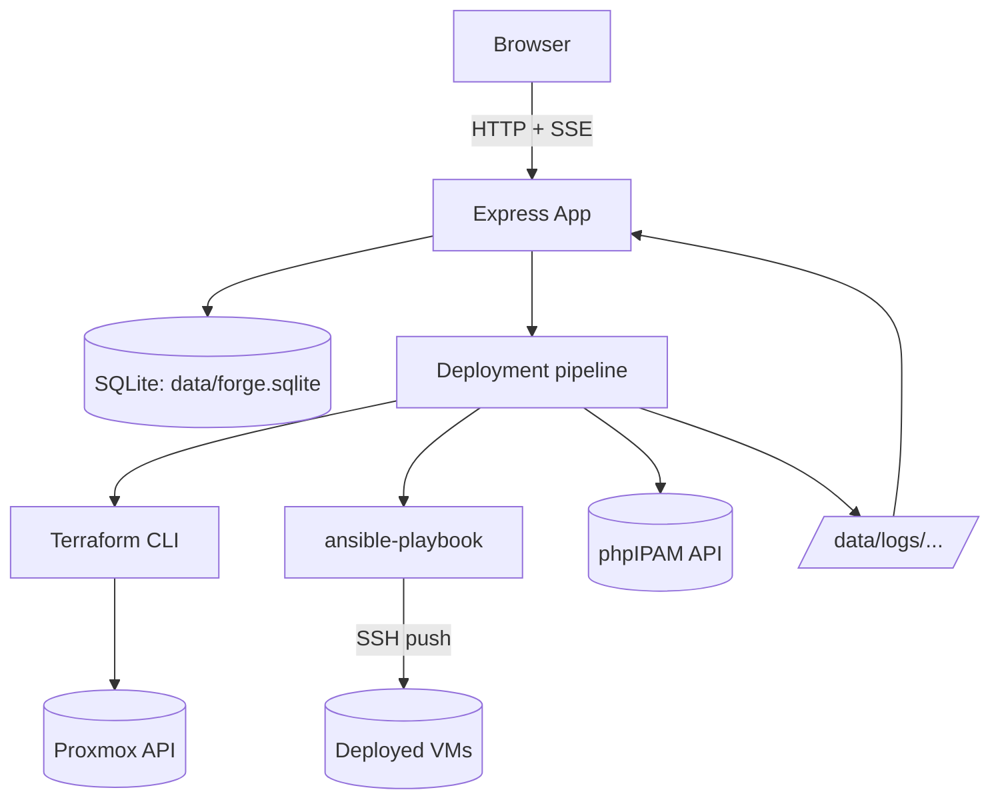

# System documentation (as-built)

This is a snapshot of how Forge actually works today, distinct from the
planning docs ([00](./00-overview.md)–[06](./06-decisions.md)), which
describe intent/decisions as they were made. Where behaviour has diverged
from the original plan, this doc reflects reality.

## What Forge is

A single Node.js/Express container that serves a dark-mode web GUI for
deploying, configuring, and destroying Proxmox VMs, wrapping Terraform
(provisioning) and Ansible (configuration) behind a step-by-step,
resumable pipeline with live log streaming.

## Runtime components

| Component | Implementation |
|---|---|
| Web server | Express (`src/app.js`), EJS views, session auth (`express-session`, in-memory store) |
| Database | SQLite via `better-sqlite3`, file at `data/forge.sqlite` |
| Job pipeline | In-process, sequential per deployment (`src/jobs/pipeline.js`), driven by `child_process.spawn` |
| IaC | Terraform CLI (`bpg/proxmox` provider ~0.71.0), per-deployment workdir under `data/workdirs/<id>/` |
| Config management | Ansible CLI (`ansible-playbook`), push model over SSH |
| IP management | phpIPAM REST API client (`src/ipam/client.js`) |
| Packaging | Docker (single image, non-root `forge` user), `docker-compose.yml` |

## Request/data flow

## Deployment lifecycle (pipeline steps)

Fixed, ordered `steps` rows per deployment, run sequentially; any step is
individually retryable (resets that step + all after it back to
`pending`, reuses prior state — IPs, Terraform state, installed
components):

1. `allocate_ips` — reserve an IP per node in phpIPAM immediately on pick (avoids a same-IP race across nodes/deployments)
2. `generate_terraform` — render `main.tf`/`provider.tf` into the deployment's workdir
3. `terraform_init`
4. `terraform_apply` — `-auto-approve`, creates VMs
5. `wait_cloud_init` — SSH poll per node (`ssh-keygen -R <ip>` first, to drop stale host keys from IP reuse; up to 30 attempts / 10s apart)
6. `ansible_run` — generate inventory + throwaway playbook, run it
7. `verify`

Destroy pipeline: `terraform_destroy` → `mark_destroyed` (workdir kept for
log history, not deleted).

Component actions (install/uninstall/reinstall one component post-deploy)
append extra `ansible_run`/`ansible_uninstall` + `verify` step pairs to the
same deployment rather than creating a new deployment.

On process boot, any step/deployment left `running` from a crash/restart
is marked `interrupted`.

## Role model (component-based)

- A **component** = one real Ansible role directory under
  `ansible/roles/<name>/` (currently `oh-my-zsh`, `btop`, `telegraf`),
  each with a matching row in the `components` table.
- A **role** (`lab`, `mgmt`, or any custom role created via `/roles`) is a
  checked set of components (`role_components`), edited through the GUI —
  no code change/redeploy needed to add or remove a component from a role.
- At deploy time, Forge generates a throwaway `site.yml` listing exactly
  the checked components as Ansible roles, `hosts: all`, `become: true`.
- Per-deployment installed state is tracked independently in
  `deployment_components` (seeded from the role at creation time, then
  diverges as components are installed/removed on that specific
  deployment without touching the role's own definition).
- **Exception**: `k3s-cluster` has `supports_sub_roles = 1` and a
  non-empty `playbook_path`, so it uses the dedicated hand-written
  `ansible/playbooks/k3s-cluster.yml` instead of the component checklist
  — node 1 auto-becomes `control-plane`, the rest `worker`.

## Data model (SQLite)

`users`, `roles`, `deployments`, `deployment_nodes` (has `sub_role`),
`steps` (has `params` TEXT for JSON like `{componentId}`), `components`,
`role_components`, `deployment_components`. Full schema:
[src/db/schema.sql](../src/db/schema.sql); narrative version:
[02-data-model.md](./02-data-model.md) (mostly still accurate, plus the
component tables added since).

## Configuration surface

All runtime config is env vars (`.env`, see
[.env.example](../.env.example)): `PORT`, `SESSION_SECRET`, `DATA_DIR`,
`MAX_CONCURRENT_DEPLOYMENTS`, Proxmox API (`PM_API_URL`,
`PM_API_TOKEN_ID`, `PM_API_TOKEN_SECRET`, `PROXMOX_TARGET_NODE`,
`PROXMOX_NETWORK_BRIDGE`, `PROXMOX_DATASTORE`, `PROXMOX_TEMPLATE_ID`),
phpIPAM (`IPAM_ENABLE`, `IPAM_URL`, `IPAM_APP_ID`, `IPAM_USERNAME`,
`IPAM_PASSWORD`, `IPAM_SUBNET_ID`), SSH (`HOST_USER`,
`SSH_PRIVATE_KEY_PATH`).

## Persistent state (must survive a container recreate)

Bind-mounted `data/` directory:
- `data/forge.sqlite`
- `data/workdirs/<deployment_id>/` — Terraform config + state per deployment
- `data/logs/<deployment_id>/<step_seq>-<step_name>.log` — full step output (DB only stores the path)
- `data/ssh_known_hosts`

SSH private key is mounted to `/run/secrets/id_rsa` (read-only) and copied
by `entrypoint.sh` to `/home/forge/.ssh/id_rsa` (chmod 600, chowned to
`forge`) at container start — a direct bind-mount of the host key file
preserves host ownership/perms that the container's non-root user can't
read.

## Dependencies

### npm (runtime)

`express`, `express-session`, `ejs`, `better-sqlite3`, `bcryptjs`,
`dotenv`, `@picocss/pico` (see [package.json](../package.json)).

### System packages (Docker image)

`ansible`, `openssh-client`, `terraform` (pinned 1.9.5, installed from
HashiCorp release zip), `gosu` (privilege drop in `entrypoint.sh`).

### External services (network dependencies, not code dependencies)

- **Proxmox API** — VM create/destroy via the `bpg/proxmox` Terraform provider.
- **phpIPAM API** (`10.4.5.66`, subnet 7) — IP allocation/reservation/release.
- **Target VMs over SSH** — Ansible push, cloud-init wait polling.

### Other repos in this GitHub account — is Forge independent of them?

**Yes, at runtime.** Forge doesn't clone, mount, `git submodule`, or
otherwise depend on any of these repos when running. Two of them were
used as one-time **sources to vendor (copy) code from**, which has since
diverged and is now maintained independently inside `forge`:

| Repo | Relationship to Forge |
|---|---|
| `terraform-deployment` | Source of the original `modules/proxmox-vm` Terraform module, **copied once** into `forge/terraform/modules/proxmox-vm`. No runtime link; re-syncing an upstream module change is a manual step (open question, see [decisions](./06-decisions.md#open-questions-need-answers-beforewhile-implementing)). Forge also does not reuse `terraform-deployment/environments/*` — each Forge deployment gets its own isolated workdir/state. |
| `ansible-deployment` | Source of the original `ansible-role-oh-my-zsh`, **copied once** into `forge/ansible/roles/oh-my-zsh` and modified since (custom `forge-arrow` theme, `deploy_user` var instead of `ansible_user_id`, added `tasks/uninstall.yml`, added the `autojump` package install task). No runtime link. |
| `ansible-telegraf-deploy` | Source of the original telegraf install approach, adapted into `forge/ansible/roles/telegraf` (install script rewritten twice since, for GPG key + apt-hang fixes). No runtime link. |
| `ansible-proxmox-deploy` | **Only remaining real dependency**, and it's operational, not code/runtime: its `build_image` role is still how the base Proxmox VM template (`PROXMOX_TEMPLATE_ID=9200`) that Forge's Terraform module clones from gets built/maintained. Forge assumes that template already exists; it does not build or call into this repo. Automating template builds from Forge is an explicit later-phase idea, not yet built (see [roadmap](./05-roadmap.md)). |
| `ansible-extend-disk` | No relationship found — not referenced by Forge. |

Net effect: you could delete all five other repos today and Forge would
keep deploying/destroying/configuring VMs without any code-level breakage
— but you'd eventually need another way to build a fresh Proxmox template
once the current one (`9200`) needs updating, since that job currently
lives only in `ansible-proxmox-deploy`.
